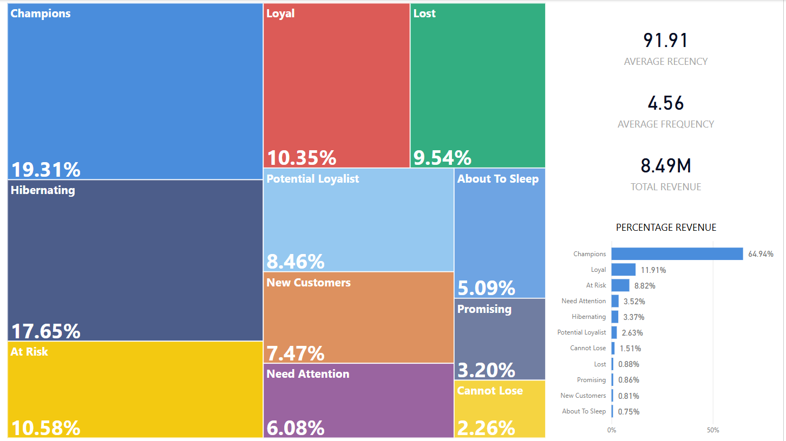
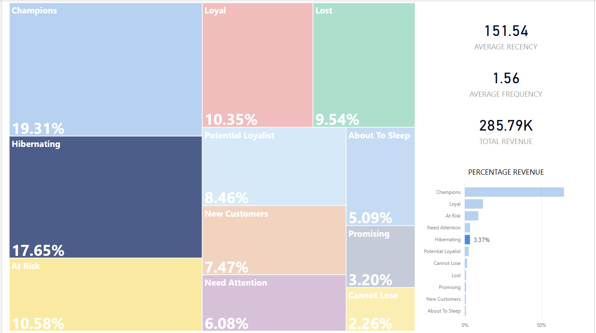

# SQL-Automated-RFM-Analysis-and-Customer-Segmentation-Project

Author:     Abhisar Sharma  
Email:      Abhisars117@gmail.com

## What is RFM Analysis ans Customer Segmentation?

RFM is a customer segmentation technique used in marketing and data analytics to identify and categorize customers based on their purchasing behavior.

After calculating RFM scores for all customers, you can create segments such as: Champions, Loyal Customers, Potential loyalists, At Risk etc.

## Why is RFM Analysis and Customer Segmentation useful?

- Helps in personalized marketing.
- Improves customer retention.
- Prioritizes marketing efforts on high-value users.
- Boosts ROI with targeted campaigns.

## 📌 Project Objectives

- Analyze customer purchase data using SQL
- Find out the 20% customers that generate 80% of revenue
- Segment customers into meaningful categories based on RFM scores
- Provide actionable insights for business decisions

## 🛠️ Tools Used

- **SQL/POSTGRESQL** – For cleaning and preparing data for analysis, RFM analysis and customer segmentation
- **Power BI** – *For visualization and dashboard creation*

## ✨ Features

-  RFM Analysis using SQL
-  Customer Segmentation logic
-  Power BI Dashboard (interactive visuals)
-  Ready for deployment/automation

## 🧮 RFM Explained

- **Recency (R):** How recently a customer made a purchase
- **Frequency (F):** How often they purchase
- **Monetary (M):** How much money they've spent

Each customer is scored based on these three dimensions, allowing you to create customer segments like:

- Champions
- Loyal
- Potential loyalist
- New customers
- Promising
- Need attention
- About to sleep
- Cannot lose
- At risk
- Hibernating
- Lost

## 📁 Dataset

The data set used in this project was taken from Kaggle: [E-Commerce Data](https://www.kaggle.com/datasets/carrie1/ecommerce-data/data)

## Screenshots

  

